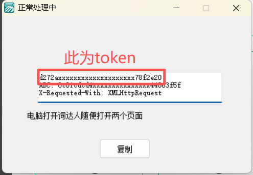
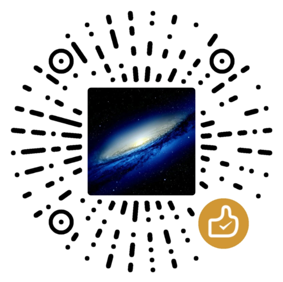

<div align="center">

    <h1>Easy_Cidaren</h1>
    <h4>Cidaren_Automatic_Answer</h4>
<p>词达人自动刷题|自动过班级任务、自学任务|<a href="https://github.com/github123666/cidaren">github123666/cidaren</a>魔改项目</p>
</div>
<div align="center">
    
    
    
</div>

## 功能简介
`词达人自动过班级任务,自学任务`
- 自动过**自学任务**
- 自动过**班级任务**
- 暂不支持自建任务（即课程）
- 随时可能失效,**且用且珍惜**
- 可手动选择指定任务
- **得分95+**（异常情况、自建任务可能80+）


## 日志
<details> <summary> <b>展开</b> </summary>

**2025-03-12**
+ 添加自动检测更新功能

**2024-12-23**
+ 修复“英译汉”题型报错

**2024-09-06**
+ 修复自建自学任务的已知问题

**2024-05-02**
+ 更新GUI

**2023-04-26**
+ 在原项目的基础上添加了手动选择章节功能
+ 将token等设置从config文件改为了在控制台输入

</details>


## 声明
+ 原项目[github123666/cidaren](https://github.com/github123666/cidaren)
+ 仅供学习参考，**严禁盗卖盈利！**使用后果由使用者承担
+ 请勿在任何平台公开发布本项目

### **侵权或有疑问请联系**
+ 邮箱：harold.lach.lei@gmail.com
+ Telegram：[harold_lach_lei](https://t.me/Harold_Lach_Lei)


## 快速上手

### 直接使用软件
1. 前往[release](https://github.com/ularch/Easy_Cidaren/releases/latest)下载最新版exe
2. 双击Easy_Cidaren.exe运行程序
3. 在弹出的图形界面中点击`帮助`->`获取token`打开token获取软件（软件来源网络，侵权请联系）**全程不要关闭黑色cmd窗口**
4. 将`词达人token获取.exe`软件置于后台，打开电脑端微信，登录并进入微信公众号`词达人`->`学生端`，随便点击几个页面
5. 返回`词达人token获取.exe`，复制软件中显示的内容（token）
<br>词达人更新后，软件获取到的内容中第一行为词达人token，
`新版本已修复，可直复制进脚本，若出错可手动复制尝试`

6. 返回图形界面，将token粘贴进`用户token`栏，点击登录
7. 使用期间除获取token外，任何设备**不要登录词达人**，否则会刷新token
### 本地python运行
#### 首次使用
1. 安装[python3.12](https://www.python.org/downloads/release/python-3123/)
2. 前往[release](https://github.com/ularch/Easy_Cidaren/releases/latest)下载最新版压缩包
3. 解压下载到的最新版压缩包
4. 双击运行程序文件夹中的`点我配置环境.bat`运行<br>或手动运行
```
pip install -r requirements.txt
```
#### 后续使用
1. 双击运行`点我运行.exe`弹出cmd页面
2. 运行过程中全程不要关闭cmd（黑色页面）
3. 后续与使用软件相同

## 支持项目
<div align="center">

</div>

[](https://starchart.cc/ularch/Easy_Cidaren)